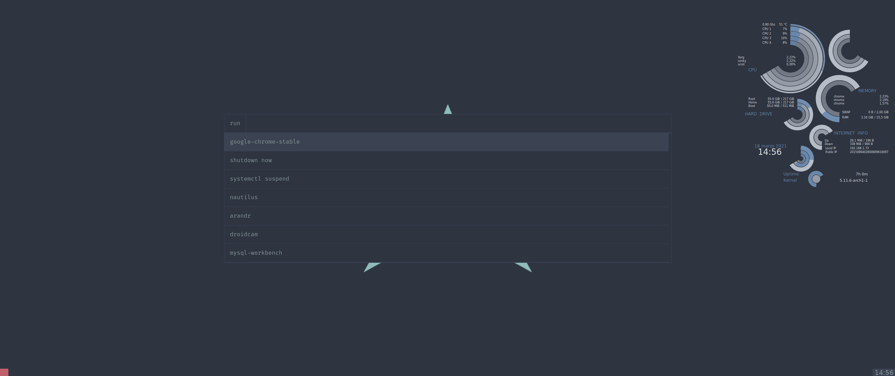
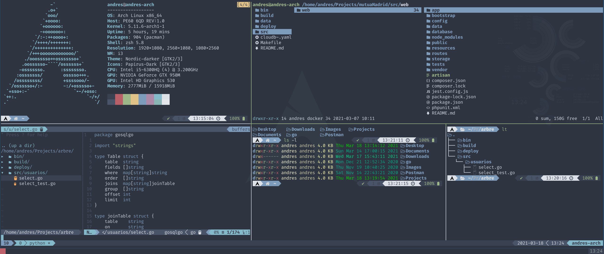

# Welcome to my dotfiles

## Packages

In case you want to do a fork of my config I use:

| Package           | Description                       |
|-------------------|-----------------------------------|
| Arch Linux        | In my opinion, the best distro    | 
| I3-wm             | A Windows Manger                  |
| Zsh               | A Powerful Shell                  |
| Oh-my-zsh         | A Zsh plugin manager              |
| Powerlevel 10     | A zsh theme                       |
| Polybar           | Bar                               |
| Rofi              | App launcher, Windows swich, etc  |
| Dunst             | A lightweight notification daemon |
| Conky             | System monitor                    |
| Picom             | Xorg compositor                   |
| Lsd               | More beautiful ls tool            |
| Ranger            | Terminal File Manager             |
| Nordic Dark Theme | GTK 3.0 Theme                     | 
| Papirus Icon      | Icon Theme                        | 
| Papirus Folders   | Nordic Folder for Papirus         | 
| Neofetch          | System Info                       | 
| Kitty             | Terminal                          |
| Nerd Fonts        | Patched Fonts                     |
| Tmux              | Terminal Multiplexor              |
| Bat               | Colored code cat                  |
| Autorandr         | Screen Profiles                   |
| Thunar            | File Manager                      |

## Keyboard Config
I Live in Spain but i prefer a english keyboard so i have this config:

```
localectl set-x11-keymap us pc105 altgr-intl
```

## Editor
I was using vim for many years but I change to nvim some days ago

## Display Manager
[https://github.com/andytechcastro/login-manager!](https://github.com/andytechcastro/login-manager)

## Screenshots

### Desktop


### Rofi



### Terminal


